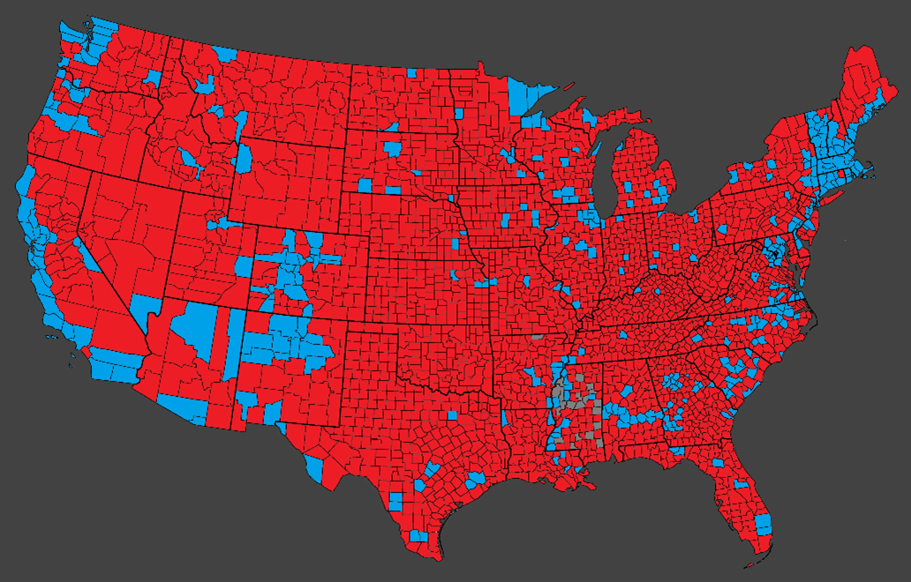
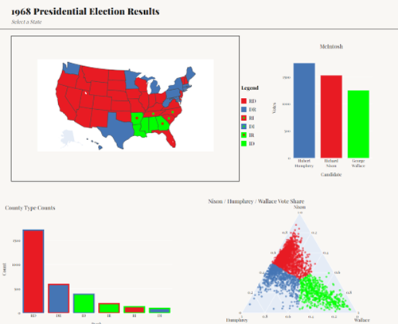
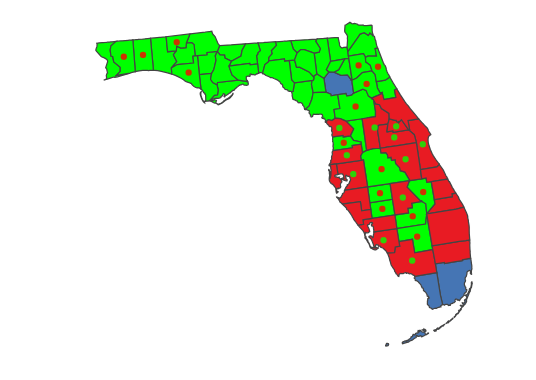
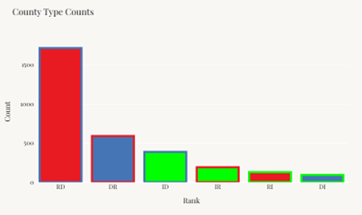
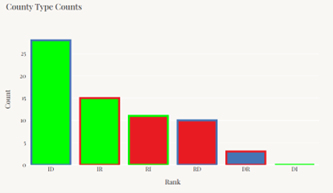
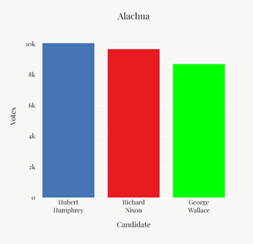
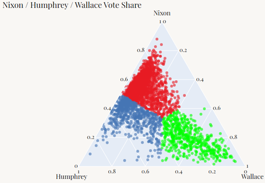
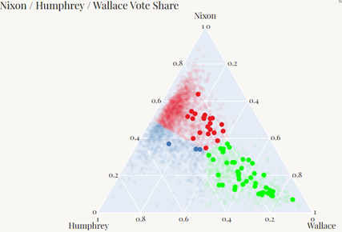

# 1968 U.S. Presidential Election Dashboard

## Introduction

This dashboard visualizes the 1968 U.S. Presidential election results by county and state, mapping first and second place finishes across the three-way race between Richard Nixon, Huberty Humphrey, and George Wallace.

---

## Background

I’m a huge fan of the data around presidential elections. In a typical two-party election, the country, a state or a county lies somewhere on a scale of **100% Republican to 100% Democrat**. Where a geography lands on this scale can likely tell you something about it.

Larger urban cities and counties typically vote Democrat, while smaller rural and suburban counties vote Republican. Never has this Urban-Rural divide been starker than it is now. This makes for a somewhat uninteresting election wide map.

Below is a map of the 2024 election by county.

Most of the United States’ area is less populated rural counties that overwhelmingly vote Republican. Contrarily, most urban counties vote Democrat. There are, of course, exceptions.

To me, this isn’t very interesting. A county that votes **65.29% for a Republican candidate like Cherokee County, Oklahoma in 2024** is almost certainly to have its remaining votes go Democrat. The county went **32.69% Democrat in 2024**. The county’s percentage vote for one candidate almost entirely determines the second-place candidates’ percentage of the vote.

An election with a major third-party candidate would mean that the second-place candidates’ percentage of the vote is not entirely contingent on the first-place finisher.

In a regular two-party race, there are general two categories for a county or state:

- **RD** (Republican-First, Democrat-Second)
- **DR** (Democrat-First, Republican-Second)

In a two-party race, county classification breaks down almost entirely along population density. A third-party candidate disrupts this linearity.

Where does a major third-party candidate find a significant voting population situated between the **Rural Republicans** and the **Urban Democrats**?

A major third-party candidate changes the number of classified counties from **two (DR & RD)** to **six (DR, DI, RD, RI, IR, ID)** where **“I” indicates “Independent.”**

This raises interesting analytical questions:

- How does a **DR** county differ from an **IR** county?
- How does an **ID** county differ from an **IR** county?

Instead of being just one way to compare counties (RD vs DR), there are now **15 unique pairwise comparisons between 6 categories**.

This dashboard seeks to provide an easy way to analyze the geographic differences between these six different kinds of counties in the **1968 election**.

The 1968 election was the last US Presidential election where a third-party candidate won a state. Independent candidate **George Wallace** ran a campaign largely on a policy of segregation, and his platform was extremely popular with Deep South states.

---

# The Dashboard

Below is a screenshot of the dashboard.

The map shows the results of the 1968 election by state. The color coding is specific to who took first and second place in a state.

## Color Coding

| Color Code | On the Map | First Place / Second Place | Examples |
|-------------|-------------|-------------|-------------|
| RD | Solid Red | Republican / Democrat | Wisconsin, Illinois, Florida |
| RI | Red with a Green Dot | Republican / Independent | South Carolina, Tennessee |
| DR | Solid Blue | Democrat / Republican | Minnesota, Washington, Michigan |
| DI | Blue with a Green Dot | Democrat / Independent | No state votes this way |
| IR | Green with a Red Dot | Independent / Republican | Arkansas, Georgia |
| ID | Solid Green | Independent / Democrat | Alabama, Mississippi |

---

## State-Level Interaction

This map is dynamic. Once a **state is clicked on**, a **county-by-county breakdown** of election results is shown with the same color scheme.

Example: Florida

*(The map may need to be clicked a second time to populate the dots indicating second place.)*

---

## County Type Frequency Chart

The bar chart on the **bottom left** shows the frequency of each kind of county in the country.

This chart will automatically update once a state is clicked on.

Example: County classifications in Florida.

---

## County Vote Totals

Once an **individual county is clicked**, the bar chart to the **right** populates and shows that county’s vote totals for the three major candidates.

Example: **Alachua County, Florida**

---

## Simplex Visualization

The chart in the **bottom right** shows each county’s vote totals normalized (to ignore fourth party candidates) and mapped on a **2-D simplex chart**.

Once a state is clicked, the chart highlights that state’s counties against that of all counties in the nation.

This allows the user to see roughly where the state’s voters are compared to the rest of the country.

Example: Florida highlighted.

---

# Data Sources and Limitations

The data came from **Wikipedia articles for each state’s individual article on the 1968 election**.

There are some limitations because of this.

## Missing Wallace Vote Totals

Wikipedia only lists a candidate’s performance on national elections if the candidate performs above **5% in a state or nationally**.

George Wallace gained less than **5% of the vote in both Connecticut and Rhode Island**, thus his vote totals are not listed for these states.

This data has been hard to come across, but further iterations will include this information.

## Alaska County-Level Data

The state of Alaska’s Wikipedia page on the 1968 election does not include a **borough-by-borough breakdown of vote totals**.

This data was similarly difficult to come across, and future iterations will include it.

## County Boundary Changes

Several counties have changed since 1968, either splitting in two or joining another county.

A national county map from 1968 could not be found that worked with Plotly, so for now **defunct counties were grouped with their modern equivalents**.
